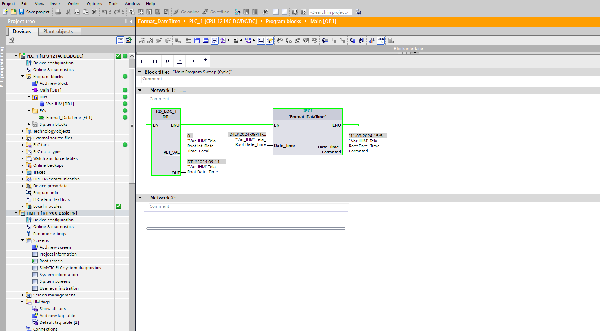
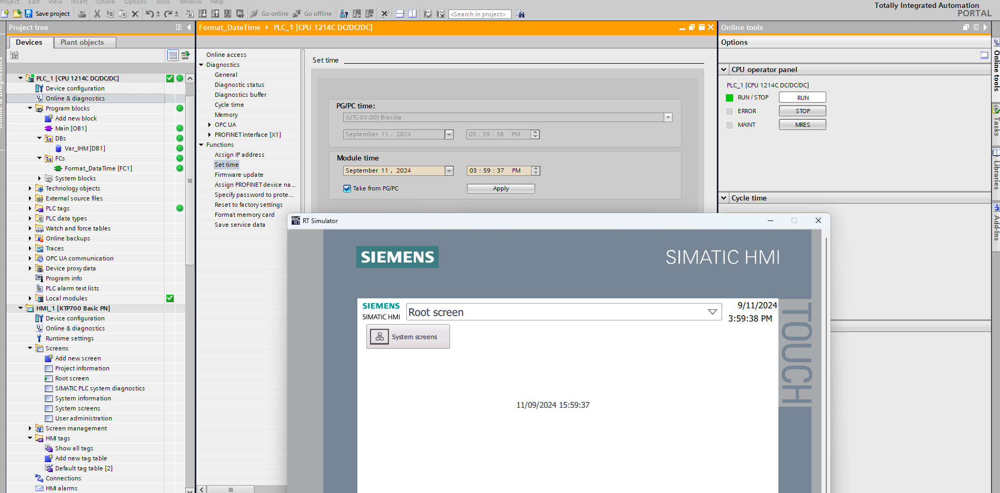
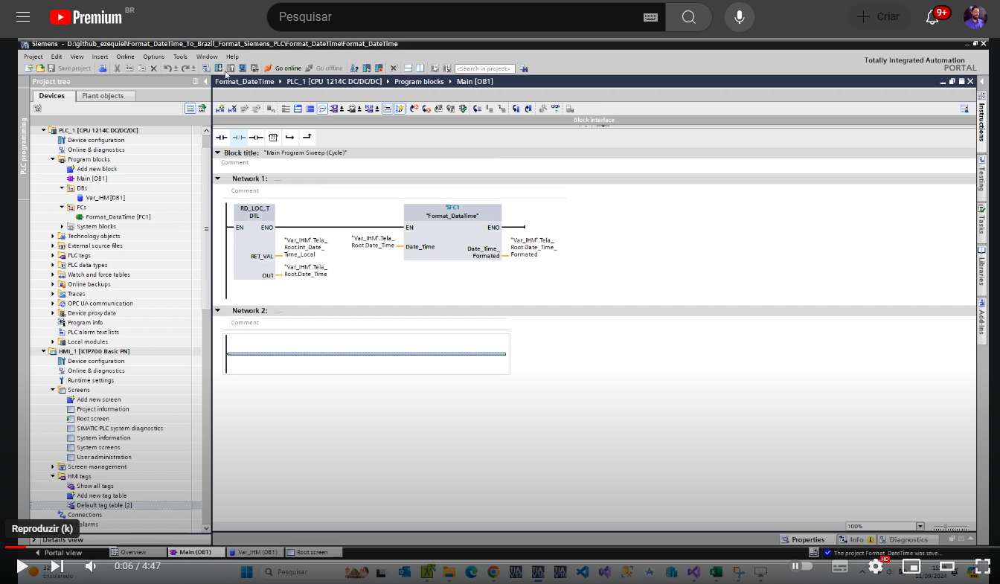

# Format DateTime

O objetivo deste projeto exemplo é apresentar uma FC que criei para formatar o Datetime para o formato dd/MM/yyyy HH:MM:SS no CLP da Siemens e poder apresentar em uma IHM.

<!-- Inserir imagem com a #vitrinedev ao final do link -->

Elaborado por Ezequiel da Silva Daniel

[Blog](https://ezequieldaniel.wordpress.com/)  
[Email](ezequielsd@gmail.com)

  

## Apresentação

Parece algo tão simples né e básico, apresentar uma data e hora na tela para orientação do operador. Mas nas IHM da série Basic Panel, não nos possibilita apresentar essa informação no formato que é comum no idioma pt_BR, DD/MM/YYYY, de forma direta. 
Bom por este motivo eu criei essa FC, onde é passado a data e hora atual, no formato datatime, e devolve uma string contendo a data e hora no padrão que conhecemos.

## Requisitos

O projeto foi desenvolvido no TIA PORTAL V18.

## Como utilizar

Basta incorporar a FC localizada na pasta FCs ao seu projeto, podendo ser arrastado para outro TIA aberto, ou usando esse projeto como base para desenvolver o seu.
O bloco possui:

**IN**

* Date_Time : Entrada que deve ser fornecida com a data e hora da CPU, no tipo DateTime.

**OUT**

* Date_Time_Formated: Fornece a hora e data já formatada, no tipo string.

Na IHM, basta colocar um objeto do tipo **IO FIELD**, para cada parte, conforme necessidade, no tipo string.

<!-- Inserir imagem com a #vitrinedev ao final do link -->

<!-- Inserir imagem com a #vitrinedev ao final do link -->

## Pacotes de terceiro

N.A.

## Autor

Ezequiel da Silva Daniel  

## Licença

[MIT]

## Release

A versão Release do programa. Se preferir pode pegar na pasta "Aquivado" o programa no formato compactado do TIA, em tamanho menor.

